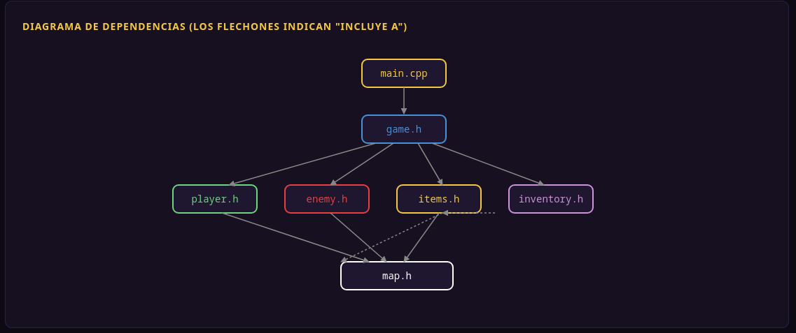
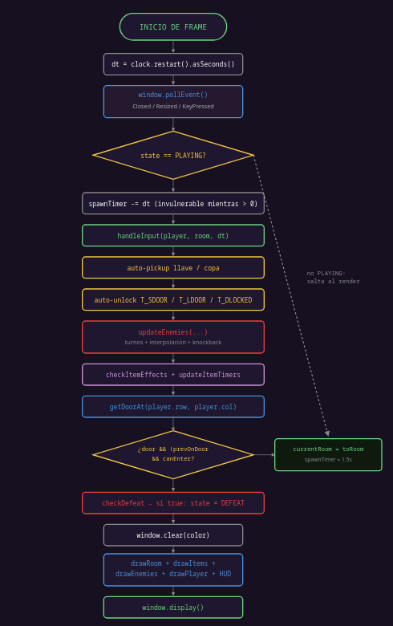
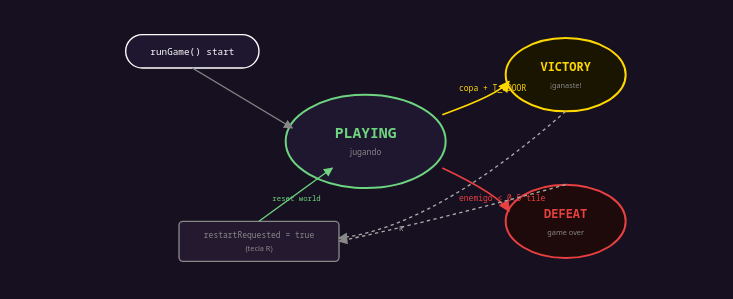
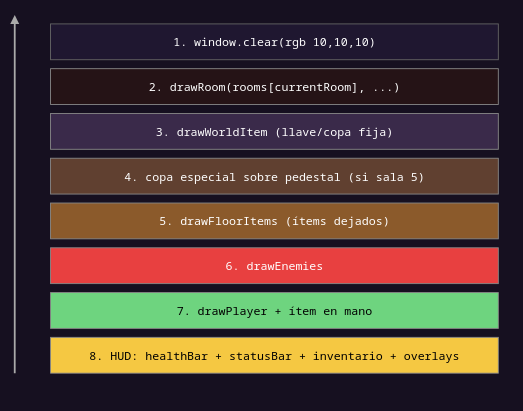
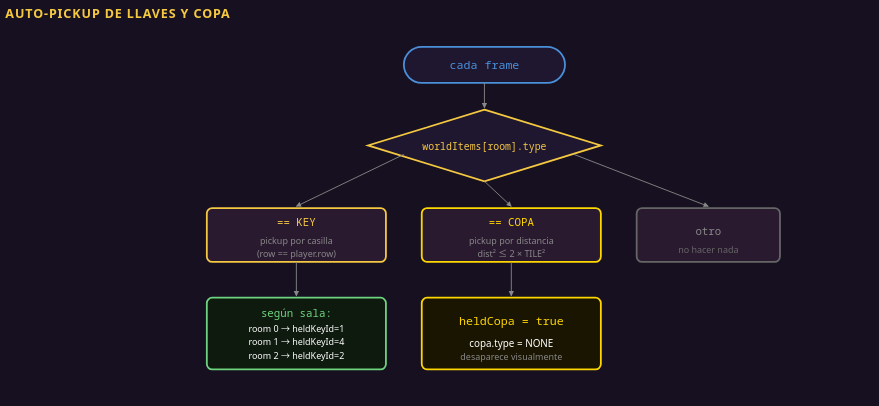

# Dungeons — Documentación

---

## Documentación general del proyecto

### 1. Dependencias entre módulos

Los flechones indican "incluye a":



`map.h` es el fundamento: define `TILE_SIZE`, `MAX_ROWS`, `MAX_COLS`, los códigos de tile y la estructura `Room`. Casi todos los módulos lo incluyen porque necesitan saber qué es un tile o cuáles son las dimensiones del mapa.

---

### 2. El game loop principal

Toda la lógica del juego converge en `runGame()` dentro de `src/game.cpp`.

```cpp
void runGame() {
    // 1. Crear ventana, cargar fuentes, cargar texturas
    ...
    while (window.isOpen() && keepRunning) {
        // 2. Inicializar partida (variables locales)
        Room rooms[MAX_ROOMS]; ...
        while (window.isOpen() && !restartRequested) {
            float dt = clock.restart().asSeconds();
            // 3. Procesar eventos (input)
            ...
            if (state == PLAYING) {
                // 4. Actualizar lógica
                ...
            }
            // 5. Renderizar
            window.clear(...);
            ...
            window.display();
        }
    }
}
```

#### Diagrama de flujo — un frame completo



#### Detalle: prevOnDoor

Sin protección, si el jugador permanece sobre una puerta cada frame volvería a teletransportarse. La variable `prevOnDoor` evita esto:

```cpp
const Door *door = getDoorAt(rooms[currentRoom], player.row, player.col);
if (door != nullptr && !prevOnDoor) {
    // transición a otra sala
}
prevOnDoor = (door != nullptr);
```

Solo se ejecuta la transición en el cambio de "no estaba en puerta → ahora sí".

#### Detección de derrota (checkDefeat)

```cpp
bool checkDefeat(const Player &p, const Enemy enemies[], int count, int currentRoom) {
    if (p.immune) return false;
    for (int i = 0; i < count; i++) {
        if (!enemies[i].alive || enemies[i].roomIndex != currentRoom) continue;
        if (enemies[i].frozenTimer > 0.0f) continue;
        float dx = enemies[i].x - p.x;
        float dy = enemies[i].y - p.y;
        if (dx < 0) dx = -dx;
        if (dy < 0) dy = -dy;
        if (dx < TILE_SIZE * 0.5f && dy < TILE_SIZE * 0.5f) return true;
    }
    return false;
}
```

---

### 3. Estados del juego

```cpp
enum GameState {
    PLAYING,    // jugando normal
    VICTORY,    // llegó a la copa + T_SDOOR
    DEFEAT      // fue atrapado por un enemigo
};
```

#### Máquina de estados



#### Transiciones

| Desde | Hasta | Disparador |
|---|---|---|
| (inicio) | PLAYING | Al entrar a `runGame()` |
| PLAYING | VICTORY | `heldCopa && tile adyacente == T_SDOOR` |
| PLAYING | DEFEAT | `spawnTimer == 0` + enemigo a menos de 0.5 tile |
| VICTORY / DEFEAT | (restart) | `R` → reset completo de la partida |

Cuando el estado no es PLAYING se dibuja un overlay semi-transparente: **VICTORY** muestra texto amarillo centrado; **DEFEAT** muestra GAME OVER con el nivel alcanzado y el récord.

---

### 4. Sistema de renderizado

SFML usa el patrón clásico **clear → draw → display**:

```cpp
window.clear(sf::Color(10, 10, 10));   // limpia el back buffer
window.draw(...);                       // dibuja sobre el back buffer
...
window.display();                       // swap buffers — muestra el frame
```

Hay dos buffers (*front* y *back*). Mientras dibujas lo haces sobre el *back*. Al llamar a `display()` se intercambian, evitando *tearing* visual.

#### Capas de renderizado (de abajo hacia arriba)

Como SFML no tiene Z-order automático, lo que se dibuja después queda encima:



#### Escalado de ventana (makeScaledView)

El juego está diseñado para 932×640 px. Una **View** de SFML escala el contenido manteniendo proporción con letterboxing automático:

```cpp
static sf::View makeScaledView(unsigned int w, unsigned int h) {
    float sx = (float)w / (float)WINDOW_W;
    float sy = (float)h / (float)WINDOW_H;
    float s  = sx < sy ? sx : sy;          // factor menor de los dos ejes
    s = std::floor(s * 2.0f) / 2.0f;       // snap a múltiplos de 0.5
    ...
}
```

---

## Documentación de innovaciones asistidas por inteligencia artificial generativa

### 1. Animación con sprite sheets

El jugador usa dos texturas distintas: `idle.png` (2 frames) y `walk.png` (4 frames). Cada frame es de 32×32 px, escalado a 2.5× en pantalla.

```cpp
const int   IDLE_TOTAL     = 2;
const int   WALK_TOTAL     = 4;
const float IDLE_FRAME_DUR = 0.28f;
const float WALK_FRAME_DUR = 0.10f;
```

#### Estados de animación


La lógica usa un **acumulador de tiempo** independiente del framerate:

```cpp
p.animTimer += dt;
while (p.animTimer >= frameDur) {
    p.animTimer -= frameDur;
    p.animFrame = (p.animFrame + 1) % total;
}
```

La transición entre estados reinicia el frame y el timer para evitar saltos visuales:

```cpp
if (nowMoving != p.isMoving) {
    p.isMoving  = nowMoving;
    p.animFrame = 0;
    p.animTimer = 0.0f;
}
```

---

### 2. El knockback físico

Cuando un CHASER intenta moverse pero queda bloqueado por un barril, se dispara una **velocidad de knockback** en dirección opuesta:

```cpp
if (e.row == prevRow && e.col == prevCol) {  // no se movió
    bool blockedByBarrel = ...;
    if (blockedByBarrel) {
        float bLen = (sr != 0 && sc != 0) ? 1.4142f : 1.0f;
        e.knockbackVX = (float)(-sc) / bLen * 280.0f;  // 280 px/s
        e.knockbackVY = (float)(-sr) / bLen * 280.0f;
    }
}
```

Mientras la magnitud de la velocidad sea mayor a 4 px/s, el enemigo se mueve por **física pura** ignorando los turnos:

```cpp
if (knockMag > 4.0f) {
    float decay = std::pow(0.004f, dt);  // frenado exponencial
    e.x += e.knockbackVX * dt;
    e.y += e.knockbackVY * dt;
    e.knockbackVX *= decay;
    e.knockbackVY *= decay;
    // resincronizar row/col desde píxel
    e.col = (int)((e.x + TILE_SIZE * 0.5f) / TILE_SIZE);
    e.row = (int)((e.y + TILE_SIZE * 0.5f) / TILE_SIZE);
}
```

> **¿Por qué `pow(0.004, dt)`?** La fórmula `v *= pow(0.004, dt)` aplicada cada frame produce un decaimiento al 0.4% en 1 segundo, independientemente del framerate. Es fricción exponencial en tiempo discreto.

#### Doble defensa contra superposición con barril

1. **Defensa de grid (push-off):** si el enemigo queda en la misma celda que un barril tras el knockback, se empuja al tile libre más cercano.
2. **Defensa de píxel:** durante la interpolación, si el siguiente píxel cae dentro del tile del barril, el movimiento se cancela.

---

### 3. Sistema de ítems

#### Tipos de ítem

| Tipo | Nombre | Efecto | placeable | singleUse |
|---|---|---|---|---|
| `NONE` | — | Slot vacío | — | — |
| `TRAP` | Trampa | Congela permanentemente al enemigo que la pise | Sí | Sí |
| `SPEEDBOOST` | Velocidad | ×1.5 velocidad por 1.5s, cooldown 5s | No | No |
| `BARREL` | Barril | Tile sólido; bloquea enemigos y causa knockback | Sí | No |
| `KEY` | Llave | Desbloquea puertas (auto-pickup) | No | Sí |
| `COPA` | Copa | Llave maestra para la victoria | No | Sí |

#### La estructura Item

```cpp
struct Item {
    ItemType type;
    char     name[32];
    bool     placeable;
    bool     singleUse;
    int      row, col;
    int      roomIndex;
    bool     isOnFloor;     // true = en suelo, false = inventario
    bool     active;
    float    effectTimer;
    float    cooldownTimer;
};
```

#### Tres almacenes de ítems

- **`worldItems[MAX_ROOMS]`** — Un ítem fijo por sala (llaves, copa). Se recogen pisando o por proximidad.
- **`inv.slots[MAX_SLOTS]`** — El inventario del jugador. Se llena al recoger ítems o abrir cofres con `E`.
- **`floorItems[MAX_SLOTS]`** — Ítems dejados en el suelo (`P` o `Q`). Pueden volver a recogerse.

> Originalmente los ítems en el suelo ocupaban un slot del inventario, causando que slots aparecieran vacíos en el panel pero internamente estuvieran ocupados. La solución fue separar completamente `floorItems[]` del inventario.

#### Efectos de ítems

```cpp
if (item.type == TRAP) {
    if (item.active) continue;
    for (int e = 0; e < enemyCount; e++) {
        if (enemies[e].row == item.row && enemies[e].col == item.col) {
            enemies[e].frozenTimer = 1.0e9f;  // permanente
            item.active = true;
        }
    }
}
```

```cpp
if (item.type == SPEEDBOOST) {
    if (item.active) {
        item.effectTimer -= dt;
        if (item.effectTimer <= 0.0f) {
            item.active        = false;
            player.speed       = 210.0f;
            item.cooldownTimer = 5.0f;
        }
    } else if (item.cooldownTimer > 0.0f) {
        item.cooldownTimer -= dt;
    }
}
```

---

### 4. Pickup de ítems

#### Auto-pickup de llaves y copa



#### ¿Por qué la copa se recoge por distancia y no por casilla?

La copa está en el tile `(16, 13)`, justo encima del pedestal `T_HOLDER` en `(17, 13)`. El holder es **sólido**, así que el jugador nunca puede pisar exactamente esa celda. Si el pickup fuera por pisada, nunca sería posible recogerla.

```cpp
float px = player.x + TILE_SIZE * 0.5f;
float py = player.y + TILE_SIZE * 0.5f;
float cx = copa.col * TILE_SIZE + TILE_SIZE * 0.5f;
float cy = copa.row * TILE_SIZE + TILE_SIZE * 0.5f;
float dx = px - cx, dy = py - cy;
float dist2 = dx*dx + dy*dy;
float limit = (float)(TILE_SIZE * TILE_SIZE) * 2.0f;  // TILE × √2 ≈ 45 px
if (dist2 <= limit) {
    copa.type = NONE;
    heldCopa  = true;
}
```
